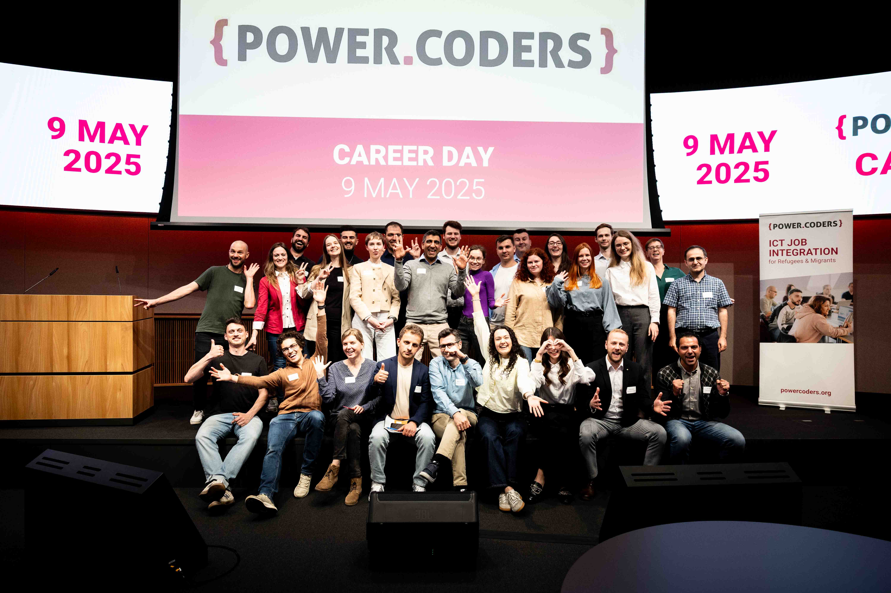
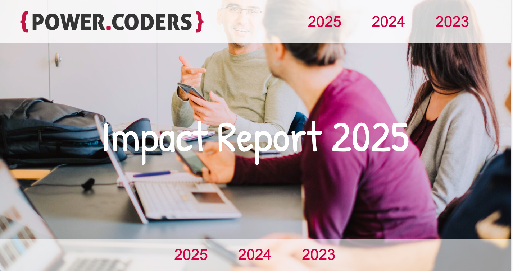
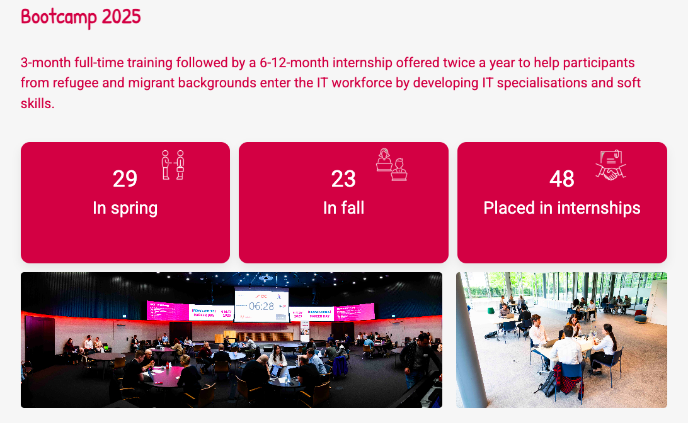
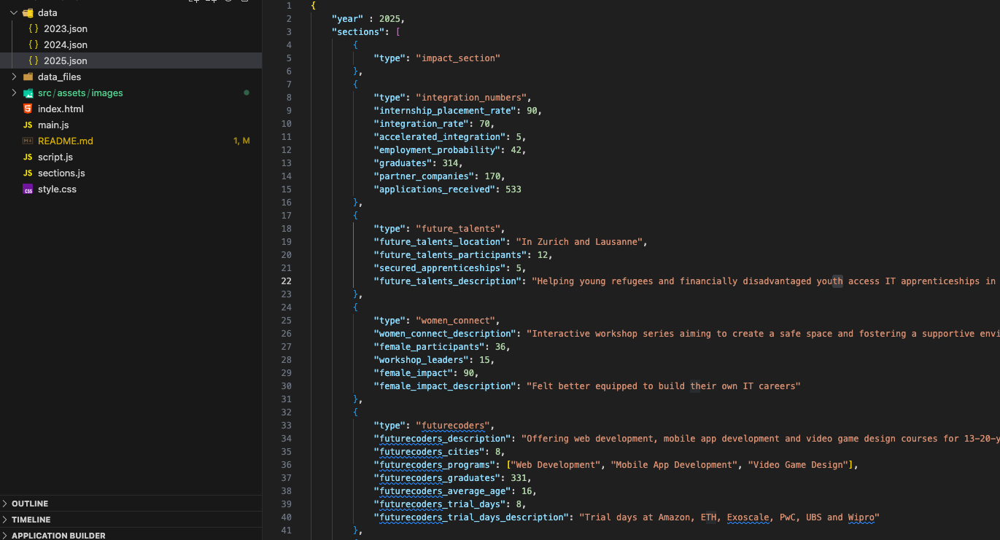

# 🌍 Impact In Motion – Powercoders Annual Report Web App



**Impact In Motion** is a responsive and interactive one-page web application that transforms Powercoders’ traditional PDF impact report into a modern, engaging, and modular digital experience.

---

## 🚀 Purpose

> “The annual report is how the world sees us.”  
> This project’s goal is to make that view clearer, more dynamic, and future-proof.

Originally a static PDF document, this new format allows the public, partners, and potential applicants to **interact with Powercoders’ impact** more easily — while making future updates simpler and more accessible for non-technical users.

---

## ✨ Features

- ✅ Responsive one-page design
- ✅ Data-driven content (JSON-based)
- ✅ Editable without coding
- ✅ Modular sections (community, bootcamp, women connect, etc.)
- ✅ Clean UI and accessible layout
- ✅ Easy extension for future years

---

## 📸 Screenshots

### 🏠 Homepage



### 📊 Interactive Impact Data



### 📂 Data JSON Structure



---

## 📁 File Structure Overview

```bash
impactinmotion/
│
├── index.html
├── main.js
├── script.js
├── section.js
├── style.css
├── README.md
│
├── data/
│   ├── 2023.json
│   ├── 2024.json
│   └── 2025.json
│
├── src/
│   └── assets/
│       └── images/
│           ├── Industry_ABB.png
│           ├── banner-impact.jpg
│           ├── screenshot-home.png
│           ├── screenshot-stats.png
│           ├── screenshot-womenconnect.png
│           ├── screenshot-json.png
│           └── ...

🧠 Project Origins & Goals

🧩 MVP: A fully functioning one-pager showing all report content interactively
✍️ Edition mode: Allow non-coders to edit content using JSON or visual interfaces
📊 Based on: 2023 and 2024 Powercoders PDF Impact Reports

🔧 Technologies Used

HTML / CSS
Javascript
JSON for data input/output
Git & GitHub for version control

💡 For Future Developers

📁 All content is driven from /data/*.json files
🖼️ Logos and visuals are stored in /src/assets/images

✨ To update for next year:

Duplicate the latest JSON
Replace content with new data
Push to a new branch
Submit PR

🤝 Team Credits

Built with dedication by a team of 4 Powercoders participants 💻
-Maryna
-Sandeep
-Dmytro
-Kubilay

🫶 Acknowledgements
Thanks to the Powercoders Team, IT Volunteers, and alumni whose efforts inspire this project and its mission.

🔗 Live Link
👉 impactinmotion.netlify.app (example)

📬 Contact
For future edits or inquiries, reach out via GitHub Issues or contact the Powercoders team.
```
